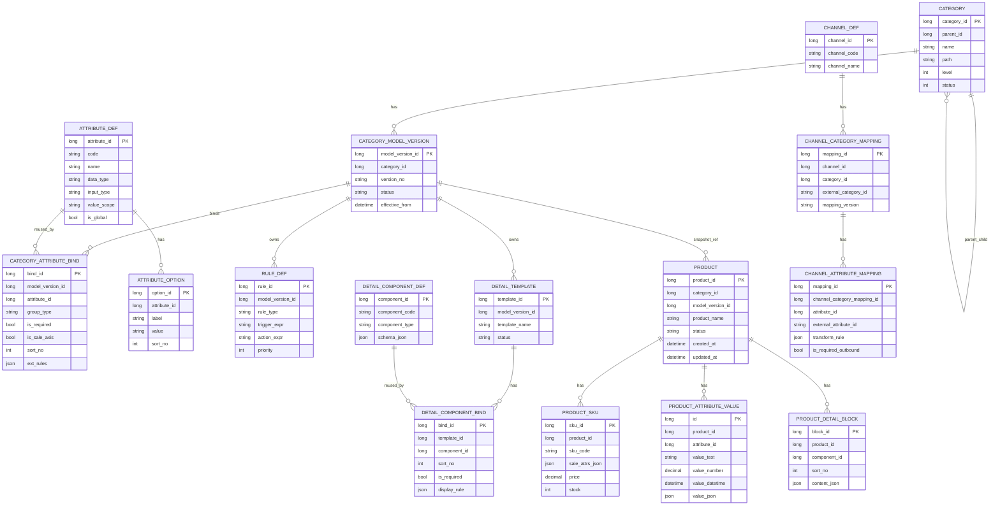

# OctopusPLM 商品系统领域模型与 ER 演进方案

## 1. 背景与目标

当前 `OctopusPLM` 已具备以下基础：

1. `Category` 类目树。
2. `PlmAttribute` 属性定义 + `CategoryAttribute` 类目属性绑定。
3. `Product.AttributesJson`、`ProductSku.SaleAttributesJson` 动态存储。

这套结构适合基础商品管理，但不足以支撑“参照 1688 的动态类目和动态详情”能力，主要差距：

1. 缺少类目/属性/规则的版本化。
2. 缺少条件显示、联动、跨字段校验规则。
3. 缺少商品详情的组件化与类目绑定。
4. 缺少内部属性到外部渠道属性的映射层。

目标是保留现有可用资产，增量演进到“元数据驱动”模型，避免推倒重建。

## 2. 目标能力边界

1. 类目决定表单：不同类目出现不同字段、校验、选项和默认值。
2. SKU 规格轴由类目配置定义，支持笛卡尔生成与批量编辑。
3. 商品详情不是固定模板，按类目绑定组件模板生成。
4. 配置可版本化发布，历史商品绑定快照，避免规则变更破坏存量数据。
5. 能输出渠道映射数据，为 1688/淘宝/抖店等对接做准备。

## 3. 目标 ER（逻辑）

## 4. 与现有模型的映射关系

1. `Category` 保留，新增 `CategoryModelVersion`。
2. `PlmAttribute` 升级为 `AttributeDef`（补 `code`、`value_scope`、`is_global`）。
3. `CategoryAttribute` 升级为 `CategoryAttributeBind`（补 `group_type`、`is_sale_axis`、`ext_rules`）。
4. `Product.AttributesJson` 可短期保留，但新增 `ProductAttributeValue` 作为结构化存储目标。
5. `ProductSku` 保留，销售属性 JSON 与 `CategoryAttributeBind.is_sale_axis` 对齐。
6. 新增 `DetailTemplate + DetailComponent` 支撑非固定详情模板。
7. 新增 `Channel*Mapping` 做渠道适配隔离。

## 5. 演进策略（不推倒）

1. V1：继续写 `AttributesJson`，同时双写到 `ProductAttributeValue`（灰度）。
2. V2：查询优先走结构化表，JSON 仅做回退。
3. V3：新建类目强制使用版本化模型与规则引擎。

## 6. 实施验收口径

1. 新增一个类目无需发版，运营可在后台配置上线。
2. 同一商品在不同类目编辑页字段集完全不同且可校验。
3. 商品详情由组件编排生成，不依赖硬编码页面。
4. 历史商品在规则升级后仍可正常查看和回溯（快照可追踪）。
5. 渠道映射可导出标准 payload，并校验必填项完整率。

