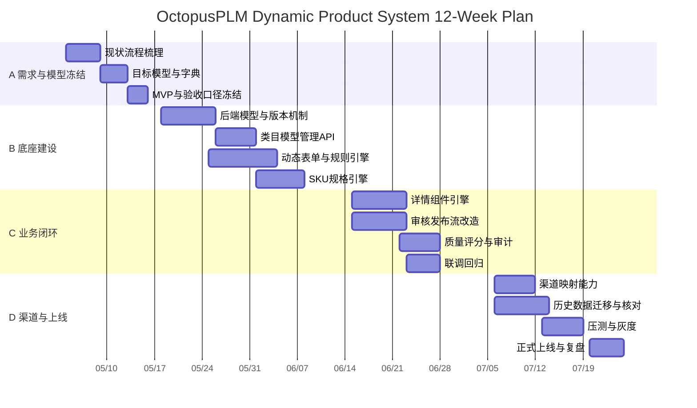

# OctopusPLM 12 周 WBS 与甘特计划（动态类目 + 动态详情）

## 1. 里程碑概览

1. `M1（W2）`：需求边界和目标数据模型冻结。
2. `M2（W6）`：类目模型中心 + 动态表单底座可用。
3. `M3（W9）`：商品编辑、详情组件、审核流联调完成。
4. `M4（W12）`：渠道映射、迁移灰度、验收上线完成。

## 2. WBS 任务分解

### 阶段 A：业务与模型冻结（W1-W2）

1. 梳理现有流程（创建、编辑、审核、发布、下架）与痛点。
2. 产出目标领域模型和数据字典（含版本策略）。
3. 确定 MVP 类目、字段、详情组件、验收口径。
4. 输出接口契约草案（前后端、配置中心、审核流）。

交付物：
1. 领域模型文档。
2. MVP 类目配置清单。
3. 验收指标基线。

### 阶段 B：平台底座建设（W3-W6）

1. 后端：新增模型版本、规则定义、详情模板、渠道映射表结构。
2. 后端：类目模型管理 API（草稿、发布、回滚、差异查询）。
3. 前端：动态表单渲染器（字段类型、条件显示、联动、校验）。
4. 前端：SKU 规格引擎（规格轴配置、组合生成、批量编辑）。
5. 质量：配置合法性校验服务（必填、冲突、循环依赖）。

交付物：
1. 配置后台可维护类目模型。
2. 商品编辑页按类目动态渲染。
3. 首批类目可走通创建保存。

### 阶段 C：业务闭环（W7-W9）

1. 商品详情组件引擎（组件库 + 类目模板绑定 + 预览）。
2. 审核发布流改造（草稿、待审、驳回、上架、下架）。
3. 数据质量策略（完整度评分、缺失提醒、规则拦截）。
4. 审计能力（模型变更日志、商品快照、规则命中记录）。

交付物：
1. 详情模板配置与渲染闭环。
2. 审核发布闭环。
3. 质量评分与预警看板基础版。

### 阶段 D：渠道与上线（W10-W12）

1. 渠道类目映射、属性映射、转换规则落地。
2. 历史数据迁移（双写、回填、抽样核对、回滚预案）。
3. 压测与稳定性验证（编辑、发布、批量操作场景）。
4. 灰度发布（按类目分批）与运营培训。

交付物：
1. 单渠道发布能力（先 1688 模式）。
2. 历史数据迁移报告。
3. 上线复盘与下阶段迭代清单。

## 3. 甘特图（12 周）

## 4. 依赖与关键路径

1. 关键路径：`模型冻结 -> 动态表单引擎 -> 详情组件引擎 -> 审核流联调 -> 灰度上线`。
2. 高风险依赖：规则复杂度膨胀、历史数据质量不足、渠道映射差异过大。
3. 控制动作：每周固定模型评审会、双写核对报表、灰度按类目分批。

## 5. 验收标准（按里程碑）

1. W2：类目、属性、规则、详情组件四类元数据均有定义和样例。
2. W6：首批 5 类目可配置并驱动商品创建。
3. W9：创建、审核、发布、详情预览完整可演示。
4. W12：灰度类目稳定运行 1 周，无 P1/P2 阻断问题。

