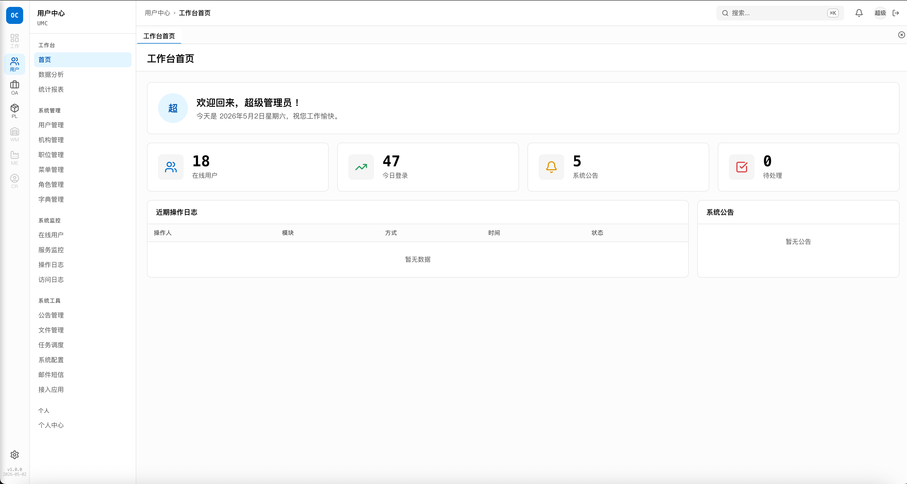
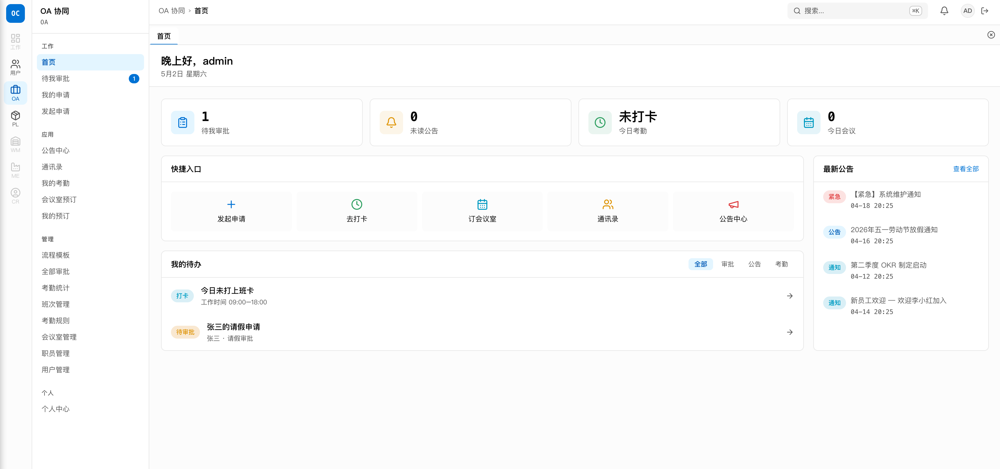
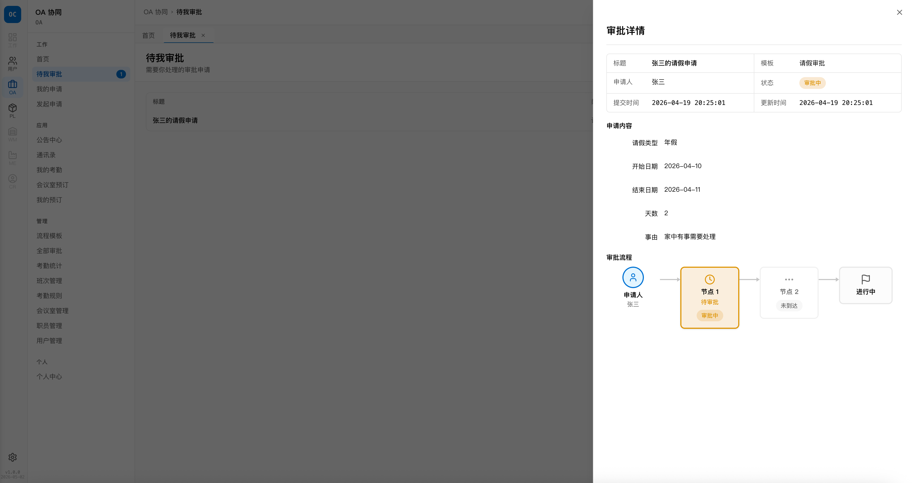
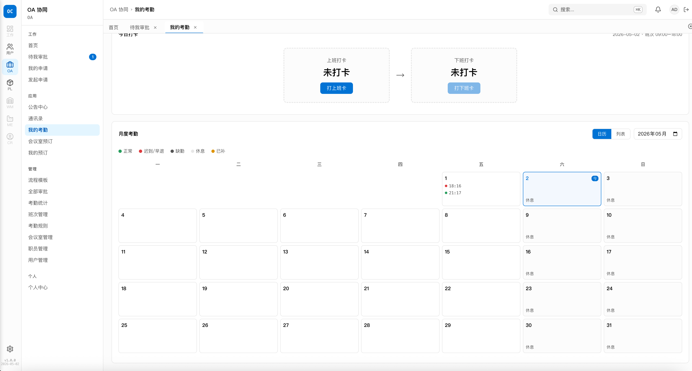
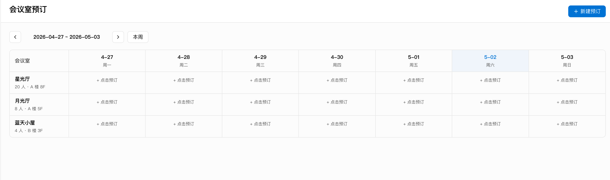
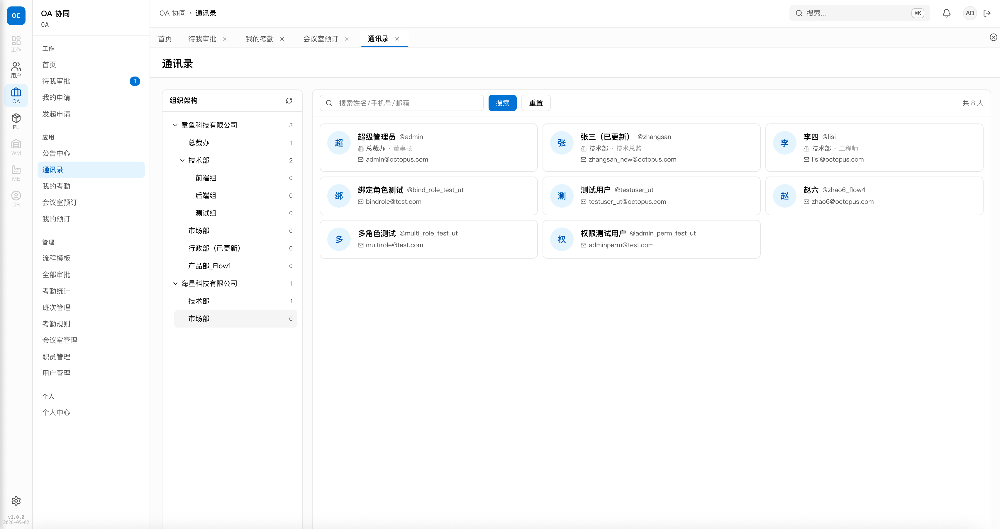
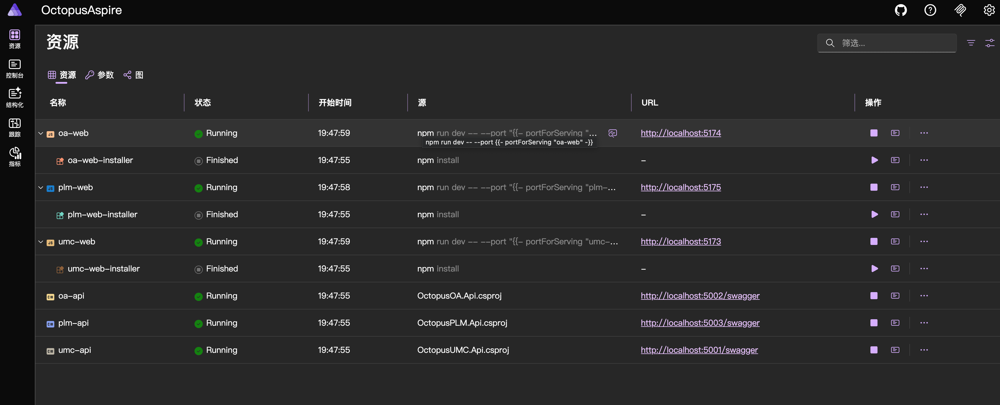
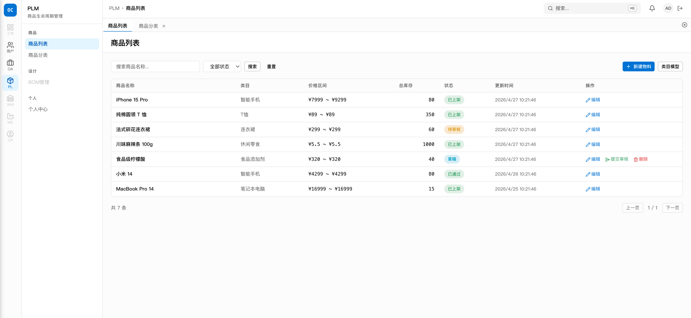
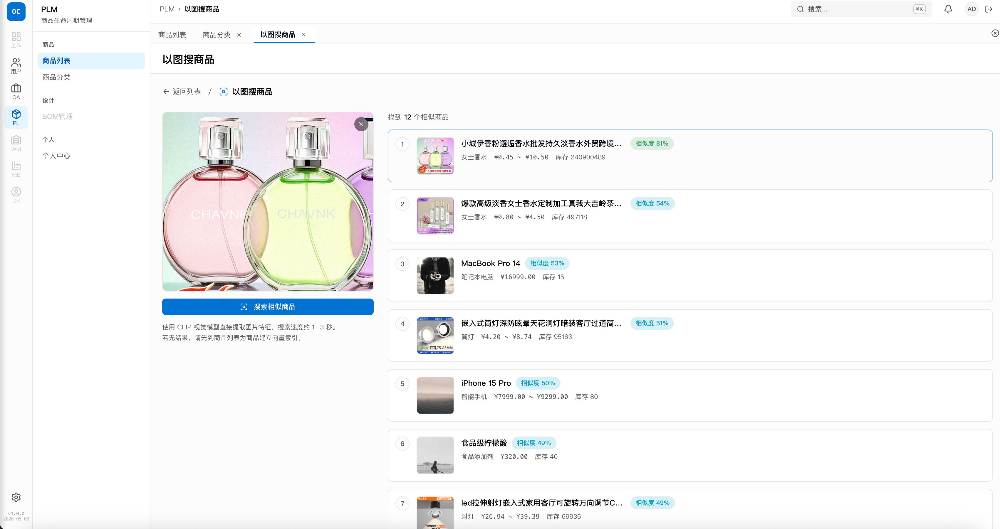

<div align="center">

# 🐙 Octopus ERP

**企业级多系统一体化平台 · 统一身份认证 · 办公自动化 · 商品生命周期管理**

[](https://claude.ai/code)
[](https://dotnet.microsoft.com)
[](https://vuejs.org)
[](https://github.com/openiddict/openiddict-core)
[](https://learn.microsoft.com/aspire)
[](#测试覆盖)
[](LICENSE)

[快速开始](#快速开始) · [系统架构](#系统架构) · [功能特性](#功能特性) · [截图预览](#截图预览) · [开发指南](#开发指南)

</div>

---

## 项目简介

Octopus ERP 是一套面向中小企业的开源企业管理平台，采用**微服务 + SSO**架构，包含三个子系统：

| 系统 | 定位 | 状态 |
|------|------|------|
| **OctopusUMC** | 统一用户中心（IdP） — 全平台身份认证、RBAC 权限、组织管理 | ✅ 生产就绪 |
| **OctopusOA** | 办公自动化 — 审批流、考勤、会议室、公告、通讯录、职员管理 | ✅ 生产就绪 |
| **OctopusPLM** | 商品生命周期管理 — 物料主数据、**以图搜商品**（CLIP 视觉向量搜索） | 🚧 开发中 |

所有子系统通过 **OpenIddict OIDC** 实现单点登录，用户只需登录一次即可访问全部授权系统。

---

## 🤖 由 Claude Code 构建

> 本项目（后端、前端、测试、文档）**100% 由 [Claude Code](https://claude.ai/code) 辅助完成**，是 AI 辅助编程在企业级项目中的完整实践案例。

### 什么让 AI 编程真正可用？—— Harness（驾驭框架）

单纯调用 AI 编写代码，会产生风格漂移、架构违反、重复解释同一约定的问题。本项目通过 **`.claude/` Harness** 解决了这些问题：

```
.claude/
├── rules/          ← 硬性约束（架构分层、TS strict、API 格式）Claude 每次会话都会遵守
├── commands/       ← 工作流菜单（/build /review /deploy /migrate）
├── agents/         ← 专用子 Agent（code-reviewer、security-auditor）
├── skills/         ← 条件触发知识（涉及部署时自动加载检查单）
└── settings.json   ← 工具权限矩阵（允许/禁止哪些 Bash 命令）

CLAUDE.md           ← 项目系统提示词（架构、规范、已知坑点）
```

**Harness 的核心价值**：

| 问题 | Harness 的解决方式 |
|------|-------------------|
| AI 忘记项目架构 | `CLAUDE.md` 每次会话自动加载，Claude 始终知道项目结构 |
| AI 生成不符合规范的代码 | `rules/` 中的约束是硬性的，不是建议 |
| 踩重复的坑 | `CLAUDE.md` "已知坑点"章节让 Claude 自动回避历史 Bug |
| 多步操作容易出错 | `commands/` 提供精确的操作步骤和成功标准 |
| PR 质量难以保证 | `agents/code-reviewer` 自动输出结构化审查报告 |

**184 个集成测试、3 个子系统、OIDC SSO、自定义审批引擎** — 全部在 Harness 约束下，由 Claude Code 辅助完成，无架构漂移。

> 📁 可复用的 Harness 模板在 [`harness-template/`](./harness-template) 目录，附完整使用说明。

---

## 截图预览

<table>
  <tr>
    <td align="center"><b>UMC · 用户管理</b></td>
    <td align="center"><b>OA · 工作台</b></td>
  </tr>
  <tr>
    <td></td>
    <td></td>
  </tr>
  <tr>
    <td align="center"><b>OA · 审批流程</b></td>
    <td align="center"><b>OA · 考勤日历</b></td>
  </tr>
  <tr>
    <td></td>
    <td></td>
  </tr>
  <tr>
    <td align="center"><b>OA · 会议室预订</b></td>
    <td align="center"><b>OA · 通讯录</b></td>
  </tr>
  <tr>
    <td></td>
    <td></td>
  </tr>
  <tr>
    <td align="center"><b>Aspire · 服务编排面板</b></td>
    <td align="center"><b>PLM · 商品管理</b></td>
  </tr>
  <tr>
    <td></td>
    <td></td>
  </tr>
  <tr>
    <td align="center" colspan="2"><b>PLM · 以图搜商品（CLIP 视觉向量搜索）</b></td>
  </tr>
  <tr>
    <td colspan="2" align="center"></td>
  </tr>
</table>

---

## 技术栈

### 后端

| 技术 | 版本 | 用途 |
|------|------|------|
| .NET | 10.0 | 运行时 |
| ASP.NET Core | 10.0 | Web 框架 |
| OpenIddict | 7.x | OIDC/OAuth2 服务端（IdP） |
| EF Core | 10.0 | ORM |
| SQLite | — | 开发环境持久化 |
| MySQL | 8.0 | 生产环境数据库 |
| SignalR | — | 实时通信（公告推送、在线用户） |
| Serilog | — | 结构化日志 |
| xUnit | 2.9 | 集成测试框架 |
| ONNX Runtime | 1.20.1 | CLIP 视觉模型推理（PLM 以图搜商品） |
| SixLabors.ImageSharp | 3.1.6 | 图像预处理（PLM 以图搜商品） |

### 前端

| 技术 | 版本 | 用途 |
|------|------|------|
| Vue | 3.5 | UI 框架（Composition API） |
| TypeScript | 5.x | 强类型（strict 模式） |
| Vite | 6.x | 构建工具 |
| Tailwind CSS | v4 | 原子化 CSS |
| shadcn-vue | latest | Headless 组件库 |
| Pinia | latest | 状态管理 |
| oidc-client-ts | latest | OIDC 客户端（SSO） |
| lucide-vue-next | latest | 图标 |
| TanStack Table | latest | 高性能表格 |

### 基础设施

| 技术 | 用途 |
|------|------|
| .NET Aspire 13.x | 一键启动编排 + 可观测性 Dashboard |
| Docker Compose | 容器化部署 |
| Qdrant | 向量数据库（PLM 以图搜商品，gRPC :6334） |

---

## 系统架构

```
┌─────────────────────────────────────────────────────┐
│                   浏览器 / 客户端                     │
│         OA.Web :5174      PLM.Web :5175              │
└──────────────┬──────────────────┬───────────────────┘
               │  OIDC 授权码流    │  OIDC 授权码流
               ▼                  ▼
┌──────────────────────────────────────────────────────┐
│              OctopusUMC（身份提供商 IdP）              │
│   UMC.Api :5001  ←→  UMC.Web :5173                  │
│   OpenIddict · RBAC · 组织管理 · 用户同步 Webhook     │
│   SQLite（开发）/ MySQL（生产）                        │
└────────────────────┬─────────────────────────────────┘
                     │  JWT Bearer Token
          ┌──────────┴──────────┐
          ▼                     ▼
┌──────────────────┐  ┌──────────────────────────────┐
│  OctopusOA.Api   │  │  OctopusPLM.Api              │
│  :5002           │  │  :5003                       │
│  审批·考勤·会议   │  │  商品·BOM·以图搜商品          │
│  SQLite / MySQL  │  │  SQLite / MySQL              │
└──────────────────┘  └──────────────┬───────────────┘
                                     │  gRPC :6334
                                     ▼
                       ┌─────────────────────────┐
                       │  Qdrant 向量数据库        │
                       │  :6333 (REST)            │
                       │  :6334 (gRPC)            │
                       │  CLIP 512-dim 向量索引    │
                       └─────────────────────────┘
          │
          └── Aspire Dashboard :15256（服务监控 + 日志聚合）
```

### 单点登录流程

```
用户访问 OA/PLM
  → oidc-client-ts 发起授权请求
  → 重定向到 UMC 登录页
  → 用户登录（Cookie 会话）
  → OpenIddict 颁发授权码
  → 换取 access_token
  → 访问 OA/PLM API（Bearer Token）
  → UMC Back-Channel Logout 同步注销
```

---

## 功能特性

### OctopusUMC · 统一用户中心

- **OIDC 身份提供商**：授权码流 + PKCE、刷新令牌、客户端凭据流
- **用户管理**：用户 CRUD、启用/禁用、重置密码、批量操作
- **组织架构**：多公司 + 多层级部门树、跨公司兼职支持
- **RBAC 权限**：角色管理、菜单权限树、五种数据权限范围
- **SSO 单点登出**：Back-Channel Logout 联动注销所有子系统
- **用户同步 Webhook**：HMAC-SHA256 签名，推送用户变更到子系统

### OctopusOA · 办公自动化

- **可定制审批流引擎**
  - 动态表单（支持文本/数字/日期/下拉/多行文本）
  - 灵活审批人配置（指定角色/用户/部门主管/自选）
  - 完整状态机（草稿 → 审批中 → 通过/驳回/撤回）
  - 审批流程图可视化（纯 CSS 节点图）
  - 内置模板：请假审批、报销审批、补卡审批

- **考勤管理**
  - 多班次配置（标准班/早班/晚班/弹性班）
  - 月度考勤日历视图 + 列表视图
  - 上下班打卡（IP 白名单控制）
  - 异常统计（迟到/早退/缺卡）
  - 补卡审批联动（审批通过自动更新考勤记录）

- **会议室预订**
  - 周视图日历（会议室 × 7 天矩阵）
  - 实时冲突检测（同房间时段重叠返回 409）
  - 我的预订管理

- **公告中心**：分级公告（通知/公告/紧急）、已读追踪、未读徽标

- **通讯录**：部门树 + 用户卡片 + 详情抽屉（含跨公司任职信息）

- **职员管理**（入职流程）
  - HR 创建临时档案 → 生成 H5 入职链接
  - 候选人自助填写（六模块：个人信息/教育/工作/家庭/紧急联系人/银行卡）
  - HR 审核 → 确认入职（自动创建 UMC 账号）
  - 五状态流转：临时 → 待入职 → 在职/拒绝/离职

- **工作台**：数据看板（待审批/未读公告/今日考勤/今日会议）+ 聚合待办

### OctopusPLM · 商品生命周期管理

- **商品管理**：商品主数据 CRUD、分类管理、规格/价格/库存、上架/下架/停产状态流转
- **以图搜商品**（CLIP 视觉向量搜索）
  - 上传任意图片，AI 直接返回最相似商品列表（约 0.2–1 秒）
  - 技术路线：`SixLabors.ImageSharp` 图像预处理 → `CLIP ViT-B/32 ONNX` 推理 → `Qdrant` 向量最近邻搜索
  - 纯 .NET 推理，无需 Python / Ollama，Apple Silicon 自动启用 CoreML Neural Engine 加速
  - 相似度可视化（绿 ≥ 60% / 蓝 ≥ 35% / 黄 < 35%）
  - 支持拖拽上传，结果可直接跳转商品编辑页
  - 批量/单品向量化 API，索引增量可控

---

## 快速开始

### 环境要求

- [.NET 10 SDK](https://dotnet.microsoft.com/download/dotnet/10.0)
- [Node.js 20+](https://nodejs.org)
- [npm 10+](https://www.npmjs.com)
- [Docker](https://www.docker.com)（PLM 以图搜商品需要，用于运行 Qdrant 向量数据库）

### PLM 以图搜商品：额外准备

使用 PLM 的以图搜商品功能前，需完成以下两步：

**1. 下载 CLIP ONNX 模型**（约 59 MB，仅需一次）

```bash
# 国际网络
bash OctopusPLM/scripts/download-models.sh

# 国内网络（使用 hf-mirror.com 镜像）
bash OctopusPLM/scripts/download-models.sh --mirror
```

**2. 启动 Qdrant 向量数据库**

```bash
docker run -d --name qdrant --restart unless-stopped \
  -p 6333:6333 -p 6334:6334 \
  -v "$(pwd)/qdrant_data:/qdrant/storage" \
  qdrant/qdrant:latest
```

> 详细说明见 [`OctopusPLM/README.md`](./OctopusPLM/README.md)

### 一键启动（推荐）

使用 **.NET Aspire** 一键启动所有服务：

```bash
# 克隆仓库
git clone https://github.com/your-org/octopus-erp.git
cd octopus-erp

# 安装前端依赖
cd OctopusUMC/web/OctopusUMC.Web && npm install && cd -
cd OctopusOA/web/OctopusOA.Web && npm install && cd -
cd OctopusPLM/web/OctopusPLM.Web && npm install && cd -

# 启动 Aspire（自动编排所有服务）
cd aspire/OctopusAspire.AppHost
dotnet run
```

启动后访问：

| 服务 | 地址 |
|------|------|
| Aspire Dashboard | http://localhost:15256 |
| UMC 管理后台 | http://localhost:5173 |
| OA 前端 | http://localhost:5174 |
| PLM 前端 | http://localhost:5175 |
| UMC API | http://localhost:5001 |
| OA API | http://localhost:5002 |
| PLM API | http://localhost:5003 |

### 默认账号

| 账号 | 密码 | 角色 |
|------|------|------|
| admin | Admin@123 | 超级管理员 |
| zhangsan | Admin@123 | 普通员工（跨公司兼职） |
| lisi | Admin@123 | 普通员工 |

> 首次启动自动创建 SQLite 数据库并植入种子数据。删除 `octopus_oa.db` / `octopus_umc.db` 后重启可重置数据。

### 独立启动（各服务分开运行）

```bash
# UMC 后端
cd OctopusUMC/src/OctopusUMC.Api && dotnet run

# UMC 前端
cd OctopusUMC/web/OctopusUMC.Web && npm run dev

# OA 后端
cd OctopusOA/src/OctopusOA.Api && dotnet run

# OA 前端
cd OctopusOA/web/OctopusOA.Web && npm run dev
```

---

## 测试覆盖

采用 **TDD 开发模式**，全量集成测试覆盖核心业务链路：

```bash
# 运行 UMC 测试（79 个）
cd OctopusUMC && dotnet test

# 运行 OA 测试（90 个）
cd OctopusOA && dotnet test

# 运行 PLM 测试（15 个）
cd OctopusPLM && dotnet test

# 查看完整业务流程日志（UMC 5 条端到端链路）
cd OctopusUMC && dotnet test --filter "Flow" --logger "console;verbosity=detailed"
```

| 项目 | 测试数 | 覆盖场景 |
|------|--------|----------|
| UMC.Api.Tests | 79 | 登录/OIDC/角色/菜单/数据权限/多公司 |
| OA.Api.Tests | 90 | 审批流/考勤/会议/公告/通讯录/职员 |
| PLM.Api.Tests | 15 | 商品CRUD/状态流转 |
| **合计** | **184** | |

---

## 项目结构

```
octopus-erp/
├── OctopusUMC/                  # 统一用户中心
│   ├── src/OctopusUMC.Api/      # 后端 API（OpenIddict + EF Core）
│   ├── tests/OctopusUMC.Api.Tests/
│   └── web/OctopusUMC.Web/      # Vue 3 管理后台
│
├── OctopusOA/                   # 办公自动化
│   ├── src/OctopusOA.Api/       # 后端 API（含 Persistence/SQLite）
│   │   ├── Persistence/         # EF Core 实体 + DbContext + 种子数据
│   │   ├── Services/            # 业务服务（Scoped）
│   │   └── Controllers/
│   ├── tests/OctopusOA.Api.Tests/
│   └── web/OctopusOA.Web/       # Vue 3 OA 前端
│
├── OctopusPLM/                  # 商品生命周期管理
│   ├── src/OctopusPLM.Api/
│   ├── tests/OctopusPLM.Api.Tests/
│   └── web/OctopusPLM.Web/
│
├── aspire/OctopusAspire.AppHost/ # .NET Aspire 编排
├── assets/                       # README 截图
├── docker-compose.yml
├── DECISIONS.md                  # 架构决策记录
└── ROADMAP.md                    # 功能路线图
```

---

## 数据库说明

开发环境使用 SQLite 文件数据库，生产环境切换到 MySQL 只需修改连接字符串：

```csharp
// 开发（默认）
builder.Services.AddDbContext<OaDbContext>(opt =>
    opt.UseSqlite("Data Source=octopus_oa.db"));

// 生产（切换 MySQL）
builder.Services.AddDbContext<OaDbContext>(opt =>
    opt.UseMySql(connectionString, ServerVersion.AutoDetect(connectionString)));
```

---

## 部署

### Docker Compose

```bash
docker compose up -d
```

### 生产环境配置

```bash
# 设置环境变量
export ConnectionStrings__OaDb="Server=...;Database=octopus_oa;..."
export ConnectionStrings__UmcDb="Server=...;Database=octopus_umc;..."
export OpenIddict__EncryptionKey="..."
export Webhooks__SharedSecret="..."
```

---

## 开发指南

### 代码规范

- 后端：整洁架构（Api → Infrastructure → Core），Controller ≤ 10 行
- 前端：TypeScript `strict` 模式，禁止 `any`，类型与后端 DTO 一一镜像
- 所有接口统一响应格式：`{ code, msg, data }`

### 新增功能流程（六步闸门制）

```
Step 1 前端样板 → Step 2 后端骨架 → Step 3 接口确认
                                            ↓
Step 6 功能验收 ← Step 5 SSO打通 ← Step 4 前后端联调
```

### 本地开发注意事项

- 修改种子数据后删除对应 `.db` 文件重启即可重建
- 前端 TypeScript 检查：`npx tsc --noEmit`
- 全量测试：`dotnet test`

---

## 路线图

- [x] UMC：OIDC 身份提供商 + SSO
- [x] UMC：RBAC 权限体系（菜单/角色/数据权限）
- [x] UMC：用户/部门/职位/字典管理
- [x] OA：可定制审批流引擎
- [x] OA：考勤管理（多班次 + 补卡联动）
- [x] OA：会议室预订（冲突检测 + 日历视图）
- [x] OA：公告中心 + 通讯录
- [x] OA：职员入职管理
- [x] OA：工作台聚合待办
- [x] Aspire 一键编排
- [x] PLM：商品管理（主数据 CRUD + 状态流转）
- [x] PLM：以图搜商品（CLIP ONNX 视觉向量搜索）
- [ ] UMC：在线用户（SignalR）
- [ ] UMC：操作日志 + 访问日志
- [ ] UMC：文件管理（OSS 策略模式）
- [ ] 移动端适配

---

## 贡献指南

欢迎提交 Issue 和 Pull Request！

1. Fork 本仓库
2. 创建功能分支：`git checkout -b feature/your-feature`
3. 提交前确保 `dotnet test` 全部通过、`npx tsc --noEmit` 无报错
4. 提交 PR，描述改动原因和测试方式

---

## License

[MIT](LICENSE)

---

<div align="center">
  <sub>
    Built with <a href="https://claude.ai/code">Claude Code</a> · 
    Powered by .NET 10 + Vue 3 + OpenIddict · 
    AI-assisted development guided by <a href="./harness-template">Claude Code Harness</a>
  </sub>
</div>
